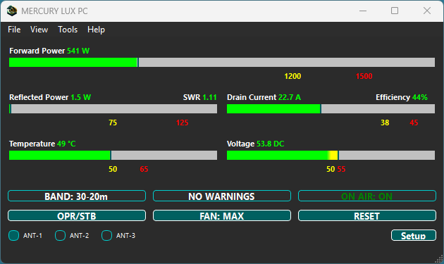

# MercuryLuxPc

**MercuryLuxPc** is a cross-platform desktop application for monitoring and controlling the **KM3KM Mercury LUX amplifier**.  
It supports **Windows**, **macOS**, and **Linux** (including **Raspberry Pi 5**), offering enhanced functionality over the default KM3KM desktop app.

Developed using **Qt (C++)**, the application provides real-time telemetry visualization, TCP/IP remote access, TLS encryption, and flexible UI options for station customization and remote operation.

---

## 🔧 Features

### 🔌 Serial Communication
- Connects to Mercury LUX via USB serial
- Auto-detects available COM ports
- Initializes amplifier and enables serial telemetry
- Manual calibration support

### 📡 TCP/IP Remote Connectivity
- Optional TCP/IP support (Disabled / Server / Client mode)
- User-defined WebSocket address and port
- Secure WebSocket (TLS) support with user-supplied certs
- Full two-way communication (telemetry and control)

### 🔐 TLS Encryption
- Optional TLS support using self-signed or CA-issued certs
- Secure WebSocket (`wss://`) communication
- Flexible file-based cert/key loading (no recompilation required)

---

## 📊 Telemetry & Visualization

### Real-Time Monitoring
- Forward Power (Watts or dBm)
- Reflected Power (Watts / SWR / Return Loss)
- Drain Voltage (V)
- Drain Current (A)
- Temperature (°C)
- Efficiency (calculated)
- Band, Antenna, and Alarm State

### PowerBar Widgets
- Threshold-based color transitions
- Configurable value ranges and labels
- Optional overlay values (e.g., SWR, Efficiency)

---

## ⚙️ Settings & Preferences
- Selectable units for power and telemetry
- Serial port and WebSocket settings stored between sessions
- TLS certificate and key path settings
- Calibration values for power and current
- Hot-reload of settings during runtime
- User-selectable font family, size, weight, and style
- Application font saved and restored between sessions

---

## 🖥️ User Interface
- Clean, resizable GUI with Dark/Light theme support
- PowerBar widgets with live color transitions and overlays
- User-defined application font for consistent display across platforms
- Responsive layout for amplifier telemetry and connection state
- Setup dialog for configuring ports, network, fonts, and preferences
- Log viewer dialog with real-time messages and clear log functionality
- Dialog for generating self-signed TLS certificate and private key

---

### 🧩 Instance Management
- Supports running multiple instances for users with more than one amplifier
- Each instance has its own isolated settings and state
- Instance number is user-selectable on startup if multiple are configured

---

## 📤 Host-to-Amplifier Command Support

Implements all known host-to-LUX commands:
- Request 8-part status string (one-time response)
- Enter standby mode
- Exit standby (operate mode)
- Reset alarms
- Select ANT-1
- Select ANT-2
- Select ANT-3
- Set fan mode to normal
- Set fan mode to max

---

## ✅ System Requirements

- **Operating System:** Windows 10/11, Linux (tested on RPi-5 & Ubuntu) or MacOS 

---

## 🛠️ Install

### 🪟 Windows
- Packaged as a Windows installer (`.exe`).
- **Download** the latest Windows release from the [Releases](#) section.
- **Run** the setup executable and follow the installation wizard.
- **Launch** the application from **Start Menu → MercuryLuxPc** or use the desktop shortcut.
- **Uninstall** via **Settings → Apps → Installed Apps → MercuryLuxPc**.

---

### 🐧 Linux
- Packaged as a compressed tarball (`.tar.gz`).
- **Download** the release that matches your architecture: `x86_64` or `aarch64` (for Raspberry Pi-5).
- Open a terminal and run:

  ```bash
  tar -xzf MercuryLuxPc_<arch>.tar.gz
  cd MercuryLuxPc_<arch>/<arch>_<version>/MercuryLuxPc
  ./install.sh
  ```

- **Launch** from the system menu under **Accessories → MercuryLuxPc** or by running:

  ```bash
  ./run.sh
  ```

- **Uninstall** with:

  ```bash
  ./uninstall.sh
  ```

---

### 🍎 macOS
- Packaged as a disk image (`.dmg`).
- **Download** the macOS `.dmg` from the [Releases](#).
- **Double-click** the `.dmg` to mount it, then drag the app to the **Applications** folder.
- If prompted by **Gatekeeper**, choose **Open Anyway** from **System Preferences → Security & Privacy**.
- **Launch** from **Launchpad** or the **Applications** folder.
- To **Uninstall**, simply delete `MercuryLuxPc.app` from the **Applications** folder.

---

## 🛠️ Development
- **Qt Version:** Qt 6.x recommended
- **C++17+**
- Build with Qt Creator or qmake
- For TLS: OpenSSL runtime libraries and valid cert/key pair

---

## 🔐 Generating Self-Signed TLS Certificates

You can generate a self-signed TLS certificate using the built-in tool:

- In the application, go to **Tools → Generate TLS Certificate**.
- This will create a valid self-signed `server.crt` and `server.key` for use with TLS connections.

Alternatively, you can generate a certificate manually using OpenSSL:

openssl req -x509 -newkey rsa:2048 -keyout server.key -out server.crt -days 365 -nodes
 
---

## 📸 Screenshot
<p align="center">
  
</p>

---

## 🛡️ License

This project is licensed under the [GNU Lesser General Public License v3.0 (LGPLv3)](https://www.gnu.org/licenses/lgpl-3.0.html).

> **Note:** *MercuryLuxPc is an approved third-party application by KM3KM Electronics. Its use does not void the amplifier warranty.*

---

## 🧰 Qt Libraries Used

This application is developed using the [Qt](https://www.qt.io/) Toolkit under the [GNU Lesser General Public License v3.0 (LGPLv3)](https://www.gnu.org/licenses/lgpl-3.0.html).  
It is **dynamically linked** to comply with LGPL requirements.

- **Qt Version:** `6.7.3`  
- **Compiler:** `MinGW 64-bit`  
- **Modules Used:**
  - `QtCore`
  - `QtGui`
  - `QtWidgets`
  - `QtSerialPort`
  - `QtWebSockets`

---

## 🙋 Support and Contact

Developed by **Ray Faucher (KB1SO)**  
📡 [https://www.qrz.com/db/KB1SO](https://www.qrz.com/db/KB1SO)

Beta testers and users are encouraged to use the following GitHub tools for support and feedback:

- 🐞 **Report bugs and request features:**  
  [GitHub Issues](https://github.com/RayJr2/MercuryXPc/issues)

- 💬 **Ask questions, share feedback, or discuss ideas:**  
  [GitHub Discussions](https://github.com/RayJr2/MercuryXPc/discussions)

Your feedback helps improve the MercuryLuxPc application—thank you for contributing!

